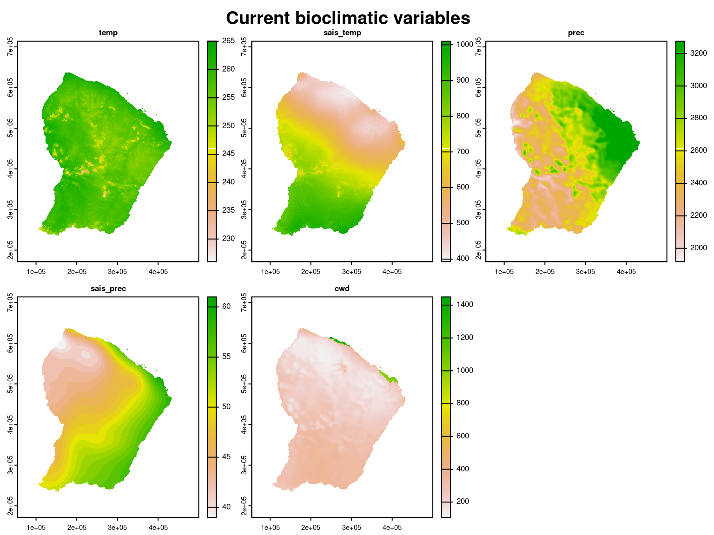
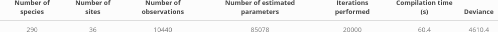
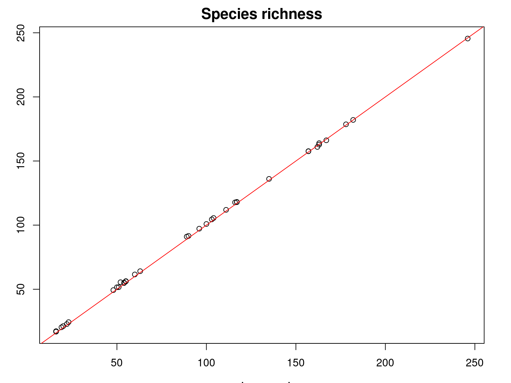

```{r setup, include=FALSE}
knitr::opts_chunk$set(
  fig.align="center",
  fig.width=8, fig.height=6,
  cache=TRUE,
  collapse=TRUE,
  comment="#>",
  highlight=TRUE,
  eval=TRUE
)
```

We want to fit JSDM in French Guiana. 

# Installation 

## jSDM R package

```{r install-jSDM, eval=FALSE}
# mail vendredi prévoir installer jSDM et gecevar
install.packages("jSDM")
# Rtools
```

## gecevar R package

```{r install-gecevar, eval=FALSE}
devtools::install_github("ghislainv/gecevar")
# grass, gdal, osmctools
```


# Load librairies

```{r load-librairies, echo=FALSE, eval=FALSE}
library(ade4)
library(parallel)
library(doParallel)
library(terra)
library(sf)
library(jSDM)
```

# Datasets

## Forest inventory 

Forest inventories carried out in French Guiana, in the context of Guyafor project are available.
We use these forest inventories to calculate a matrix indicating the presence by a $1$ and the absence by a $0$ of the species at each site by removing observations for which the species is not identified and rare species with less than 5 observations on all sites. This matrix therefore records the occurrences of $290$ species at $36$ sites.

```{r forest-inventory}
library(readr)
## Guyafor
f <- "/home/clement/Documents/projet_METRADICA/data/Inventaires/202110_DonneesModeleMetradicaTout+Diam.csv"
df <- readr::read_delim(f, delim=";")
df <- df[df$Project=="Guyafor",]
nplots <- length(unique(df$idPlot))
# Remove indeterminate taxa 
df <- df[-grep("Indet", df$Taxon), ]
# Remove taxa not defined at species but subspecies level
df <- df[-grep("subsp.", df$Taxon), ]
nsp <- length(unique(df$Taxon))

# forest inventory
trees <- df
# presence/absence of each species on each plot
nplot <- length(unique(trees$idPlot))
species <- unique(trees$Taxon)
nsp <- length(species)
# presence/absence of each species on each plot
PA <- matrix(0, nplot, nsp)
rownames(PA) <- paste(sort(as.numeric(unique(trees$idPlot))))
colnames(PA) <- paste0("sp_", 1:nsp)
#colnames(PA) <- unique(trees$Taxon)
for (i in 1:nplot){    
  for (j in 1:nsp){
    idx <- which(trees$Taxon == species[j])
    PA[paste(trees$idPlot[idx]),j] <- 1 
  }
}
# Remove very rare species 
rare_species <- which(colSums(PA)<=5)
trees <- trees[!(trees$Taxon %in% names(rare_species)),]
PA <- PA[ ,which(colSums(PA)>5)]
nsp <- ncol(PA)
nplot <- nrow(PA)
```

We represent the presence-absence matrix obtained for the first 20 species 

```{r PA-table, include=FALSE, eval=FALSE}
knitr::kable(PA[,1:20], digits=1, booktabs=TRUE, align = 'c') %>%
  kableExtra::kable_styling(latex_options=c("HOLD_position","striped"), full_width=FALSE) %>% 
  kableExtra::save_kable(file="~/Documents/presentations/workshop-Metradica-March2023/jSDM_tutorial_cache/PA_FG.png")
```

\cr 
\cr
```{r FG-PA, echo=FALSE, out.width=900, eval=TRUE}
knitr::include_graphics("jSDM_tutorial_cache/PA_FG.png")
```

## Current environmental variables

We use the function [`get_chelsa_current`](https://ecology.ghislainv.fr/gecevar/reference/get_chelsa_current.html) from the R package [`gecevar`](https://ecology.ghislainv.fr/gecevar) to download a set of climatic data for French Guiana from the website: \url{chelsa-climate.org}.  

```{r download-climate-data}
library(gecevar)
name <- "French Guiana"
epsg <- 2972
output_file <- "/home/clement/Documents/presentations/workshop-Metradica-March2023/jSDM_tutorial_cache"
setwd("/home/clement/Documents/presentations/workshop-Metradica-March2023/jSDM_tutorial_cache/")
# Get French Guiana extent in the specified coordinates system (EPSG)
output <- transform_shp_country_extent(EPSG = epsg,
                                       country_name = name, 
                                       rm_download=FALSE)
extent <- output[[1]][1]
extent_latlon <- as.numeric(output[[1]][2:5])
clim_path <- get_chelsa_current(extent_latlon = extent_latlon,
                                extent = extent,
                                EPSG = epsg,
                                destination = output_file,
                                resolution = 1000,
                                rm_download = TRUE)
```

```{r clim-data-table, eval=TRUE, echo=FALSE}
library(kableExtra)
Variable <- c("Minimum monthly temperatures", "Maximum monthly temperatures",
              "Average monthly temperatures", "Monthly precipitation", "Cloud cover", 
              "Climatic water deficit (Thornthwaite)",
              "Potential evapotranspiration (Thornthwaite)", "Number of dry months (Thornthwaite)",
              "Climatic water deficit (Penman-Monteith)", "Potential evapotranspiration (Penman-Monteith)", 
              "Number of dry months (Penman-Monteith)", "Annual mean temperature (bio1 or temp)",
              "Diurnal temperature range (bio2)", "Isothermality (bio3=bio2/bio7)",
              "Seasonality of temperatures (bio4 or sais_temp)", 
              "Maximum temperature of the warmest month (bio5)",
              "Minimum temperature of the coldest month (bio6)",
              "Annual temperature range (bio7=bio5-bio6)",
              "Average temperature of the wettest quarter (bio8)",
              "Average temperature of the driest quarter (bio9)",
              "Average temperature of the warmest quarter (bio10)",
              "Average temperature of the coldest quarter (bio11)",
              "Cumulative annual precipitation (bio12 or prec)",
              "Cumulative precipitation of wettest month (bio13)",
              "Cumulative precipitation of the driest month (bio14)",
              "Seasonality of rainfall (bio15 or sais_prec)",
              "Precipitation in wettest quarter (bio16)",
              "Precipitation of driest quarter (bio17)",
              "Warmest quarter precipitation (bio18)",
              "Coldest quarter precipitation (bio19)")

Unit <- c(rep("°C x 10", 3),
          "$kg.m^{-2}.month^-1$", "\\%", "$kg.m^{-2}$", "$kg.m^{-2}.month^-1$", "months", 
          "$kg.m^{-2}$", "$kg.m^{-2}.month^-1$", "months", rep("°C x 10",11),
          "$kg.m^{-2}.year^{-1}$", "$kg.m^{-2}.month^{-1}$", "$kg.m^{-2}.month^{-1}$",
          "$kg.m^{-2}$", rep("$kg.m^{-2}.month^{-1}$", 4))

dataset <- data.frame(Variable, Unit)
colnames(dataset )<- c("Variable", "Unit")
knitr::kable(dataset, row.names=F, booktabs=TRUE, align = 'l', escape=FALSE, 
             caption="Climate data downloaded from https://chelsa-climate.org/") %>%
  kableExtra::kable_styling(latex_options=c("HOLD_position","striped"), full_width=FALSE)
```

Among the climatic data downloaded, concerning the whole French Guiana territoty at present (interpolations of representative observed data from the years 1960-1990).
We choose to use the following variables because they have an ecological meaning which makes them easily interpretable and are little correlated between them according to the article @Vieilledent2013 : 

- **temp**: the average annual temperature ($^\circ C\times 10$).
- **prec**: the average annual precipitation (mm).
- **sais_temp**: the seasonality of temperatures corresponds to the standard deviation of monthly temperatures multiplied by $100$.
- **sais_prec**: the seasonality of precipitation as a coefficient of variation.
- **cwd**: the annual climatic water deficit (mm) is based on monthly precipitation ($prec$) and potential evapotranspiration ($pet$) which is defined as the amount of evaporation that would occur in a month if a sufficient water source were available: $\mathrm{cwd}= \sum_{m=1}^{12}\min(0, \ \mathrm{prec}_m-\ \mathrm{pet}_m)$.

We consider also the quadratic effects of these climate variables to perform a quadratic regression, which is more suitable for fitting a niche model than a linear regression. 

```{r current-environmental-variables}

# get interesting covariates among the climatic variables downloaded  
clim_var <- terra::rast(clim_path,
                        lyrs=c("bio1", "bio4", "bio12", "bio15", "cwd_penman"))
names(clim_var) <- c("temp", "sais_temp", "prec", "sais_prec", "cwd")
proj <- terra::crs(clim_var)

# Data restricted to French Guiana's borders
borders <- terra::vect(output[[2]], layer="gadm36_GUF_0")
borders <- terra::project(borders, proj)
clim_var <- terra::mask(clim_var, borders)
# representation
par(oma=c(0,0,2,1))
terra::plot(clim_var, legend=TRUE)
title("Current bioclimatic variables", outer=TRUE, cex=0.8)

# spatial points of each plot
coords <- unique(cbind(as.numeric(trees$Xutm),
                       as.numeric(trees$Yutm),
                       as.numeric(trees$idPlot),
                       trees$SourceCoord, trees$UTMZone))
colnames(coords) <- c("Xutm","Yutm","plot", "sourceCoord", "UTMZone")
coords_plot <- coords[coords[,"sourceCoord"]=="plot",]
coords_tree <- data.frame(coords[coords[,"sourceCoord"]=="tree",])
coords_tree <- coords_tree[!(coords_tree[,"plot"] %in% coords_plot[,"plot"]), ]
sites <- unique(coords_tree[,"plot"])
coords <- coords_plot 
for(i in 1:length(sites)){
mat <- coords_tree[coords_tree$plot==sites[i], ]
coords <- rbind(coords, mat[which.min(mat$Xutm),])
}
coords$plot <- as.numeric(coords$plot)
coords$Xutm <- as.numeric(coords$Xutm)
coords$Yutm <- as.numeric(coords$Yutm)
coords <- coords[sort(coords[,3], index.return=TRUE)$ix,]
# UTM22N coordinates system
xy <- terra::vect(coords[,1:2], crs=proj, geom=c("Xutm", "Yutm"))

# Add squared data
clim_var2 <- c(clim_var, clim_var^2)
names(clim_var2) <- c(names(clim_var), paste0(names(clim_var),
                                              rep("2", dim(clim_var)[3])))


# extract climatic data on each plot
clim2 <-  terra::extract(clim_var2, xy)
pos <- coords[,1:3]
colnames(pos) <- c("Xutm","Yutm","plot")

# Add squared data
data_clim2 <- data.frame(cbind(clim2[,-1], pos))
nparam <- ncol(data_clim2) -3
library(tidyverse)

# reduced centered data
scaled_data_clim2 <- scale(data_clim2[,1:nparam])
means <- attr(scaled_data_clim2,"scaled:center")
sds <- attr(scaled_data_clim2,"scaled:scale")
scaled_data_clim2 <- as_tibble(cbind(plot=data_clim2$plot,
                                     scaled_data_clim2,
                                     Xutm=data_clim2$Xutm, 
                                     Yutm=data_clim2$Yutm))

## Design matrix
X <- data.frame(intercept=rep(1,nplot),
                dplyr::select(scaled_data_clim2,-Xutm,-Yutm, -plot))
np <- ncol(X)

# save raster in .tif format
# Center and reduce climatic variables 
# using means and standard deviations of climatic variables at inventory sites
scaled_clim_var <- (clim_var2-means)/sds
names(scaled_clim_var) <- names(clim_var2)
terra::writeRaster(scaled_clim_var,
                   "~/Documents/presentations/workshop-Metradica-March2023/jSDM_tutorial_cache/scaled_clim.tif",
                   gdal=c("COMPRESS=LZW", "PREDICTOR=2"), overwrite=TRUE)
```

```{r current-environmental-variables2, echo=FALSE, out.width=800, eval=FALSE}

```

The values of these climate variables corresponding to the coordinates of the inventory plots are extracted and scaled to obtain the following data-set where coordinates of the sites will then be used for spatial interpolation and to spatially represent the results.

```{r current-environmental-data, echo=FALSE, out.width=800}
kable(head(scaled_data_clim2), digits=3) %>%
  kable_styling(bootstrap_options = "striped", 
                latex_options= c("HOLD_position","striped"),
                full_width = FALSE) 
```

# Fitting joint species distribution model (JSDM) 

## Model definition

Referring to the models used in the articles @Warton2015 and @Albert1993, we define the following latent variable model (LVM) to account for species co-occurrence on all sites :

$$ \mathrm{probit}(\theta_{ij}) =\alpha_i + \beta_{0j}+X_i.\beta_j+ W_i.\lambda_j $$

- Link function probit: $\mathrm{probit}: q \rightarrow \Phi^{-1}(q)$ where $\Phi$ correspond to the distribution function of the reduced centered normal distribution.

- Response variable: $Y=(y_{ij})^{i=1,\ldots, n_{site}}_{j=1,\ldots,n_{species}}$ with:

$$y_{ij}=\begin{cases}
0 & \text{ if species $j$ is absent on the site $i$}\\
1 &  \text{ if species  $j$ is present on the site $i$}.
\end{cases}$$

- Latent variable $z_{ij} = \alpha_i + \beta_{0j} + X_i.\beta_j + W_i.\lambda_j + \epsilon_{i,j}$, with $\forall (i,j) \ \epsilon_{ij} \sim \mathcal{N}(0,1)$ and such that:

$$y_{ij}=\begin{cases}
1 & \text{if} \ z_{ij} > 0 \\
0 &  \text{otherwise.}
\end{cases}$$

It can be easily shown that: $y_{ij} \sim \mathcal{B}ernoulli(\theta_{ij})$. 

- Latent variables: $W_i=(W_i^1,\ldots,W_i^q)$ where $q$ is the number of latent variables considered, which has to be fixed by the user (by default $q=2$).
We assume that $W_i \sim \mathcal{N}(0,I_q)$ and we define the associated coefficients  $\lambda_j=(\lambda_j^1,\ldots, \lambda_j^q)'$, also known as "factor loadings" [@Warton2015]. We use a prior distribution $\mathcal{N}(0,1)$ for all lambda not concerned by constraints to $0$ on upper diagonal and to strictly positive values on diagonal. 

- Explanatory variables: bioclimatic data about each site. $X=(X_i)_{i=1,\ldots,n_{site}}$ with $X_i=(x_i^1,\ldots,x_i^p)\in \mathbb{R}^p$ where $p$ is the number of bioclimatic variables considered.
The corresponding regression coefficients for each species $j$ are noted : $\beta_j=(\beta_j^1,\ldots,\beta_j^p)'$. We use a prior distribution $\mathcal{N}(0,1)$ for all beta.  

- $\beta_{0j}$ correspond to the intercept for species $j$ which is assumed to be a fixed effect. We use a prior distribution $\mathcal{N}(0,10)$ for the species intercept. 

- $\alpha_i$ represents the random effect of site $i$ such as $\alpha_i \sim \mathcal{N}(0,V_{\alpha})$ and we assume that $V_{\alpha} \sim \mathcal {IG}(\text{shape}=0.1, \text{rate}=0.1)$ as prior distribution by default. 

This model is equivalent to a multivariate GLMM $\mathrm{g}(\theta_{ij}) = \alpha_i + X_i.\beta_j + u_{ij}$, where $u_{ij} \sim \mathcal{N}(0, \Sigma)$ with the constraint that the variance-covariance matrix $\Sigma = \Lambda \Lambda^{\prime}$, where $\Lambda$ is the full matrix of factor loadings, with the $\lambda_j$ as its columns. 

## Parameters inference

We fit a binomial joint species distribution model, including two latent variables and random site effect using the `jSDM_binomial_probit()` function to perform binomial probit regression considering all the species from the data described above, by performing $80 000$ iterations including $40 000$ of burn-in and we retain $N_{samp}=1 000$ values for each parameter of the model.
We use species's prevalence as starting values for species intercept $\beta_0$. 

```{r fit-jSDM-FG-data, echo=TRUE, eval=FALSE}
# Prevalence of species 
np <- ncol(dplyr::select(scaled_data_clim2, -site, -lat, -long)) +1
prevalence <- colSums(PA)/nrow(PA)
beta_start <- matrix(0,np,ncol(PA))
beta_start[1,] <- qnorm(prevalence)
# 
T1<- Sys.time()
mod <- jSDM::jSDM_binomial_probit(
  # Response variable 
  presence_data = PA, 
  # Explanatory variables 
  site_formula = ~ temp + prec + sais_temp + sais_prec + cwd + temp2 + prec2 + sais_temp2 + sais_prec2 + cwd2,   
  site_data=scaled_data_clim2, 
  n_latent=2,
  site_effect="random", 
  # Chains
  burnin= 40000, mcmc=40000, thin=40,
  # Starting values
  alpha_start=0, beta_start=beta_start,
  lambda_start=0, W_start=0,
  V_alpha=1, 
  # Priors
  shape_Valpha=0.1,
  rate_Valpha=0.1,
  mu_beta=0, V_beta=c(10,rep(1,np-1)),
  mu_lambda=0, V_lambda=1,
  # Various 
  seed=1234, verbose=1)
T2 <- Sys.time()
T_FG <- difftime(T2,T1)
save(mod, T_FG, file="~/Documents/presentations/workshop-Metradica-March2023/jSDM_tutorial_cache/mod_FG.RData")
```

```{r fit-JSDM-FG-table, echo=FALSE}
load("~/Documents/presentations/workshop-Metradica-March2023/jSDM_tutorial_cache/mod_FG.RData")
nsp<-ncol(mod$model_spec$presence_data)
nplot<-nrow(mod$model_spec$presence_data)
p <- ncol(mod$model_spec$beta_start)
T_all <- as.numeric(T_all,units="hours")
results <- data.frame(nsp,nplot,
                      n_obs=nsp*nplot,n_param=(p+1)*nsp+2*nsp-1+2*nplot+nplot+1,
                      ngibbs="80000","Time"= T_all, dev=mean(mod$mcmc.Deviance))
colnames(results)<- c("Number of species", "Number of sites", "Number of observations","Number of estimated parameters", "Iterations performed","Compilation time (hours)","Deviance")
knitr::kable(results, row.names=F, digits=1, booktabs=TRUE, align = 'c') %>%
  kableExtra::kable_styling(latex_options=c("HOLD_position","striped"), full_width=FALSE) %>% 
  kableExtra::save_kable(file="~/Documents/presentations/workshop-Metradica-March2023/jSDM_tutorial_files/mod_FG.png")

```

\cr 
\cr
```{r FG-fitting-mod, echo=FALSE, out.width=900, eval=FALSE}

```


The MCMC algorithm is used to obtain draws from the posterior distribution of the parameters. We use as estimator for each parameter the mean of the $N_{samp}$ values estimated in corresponding MCMC chain and we save the estimated parameters in .csv format.

```{r save-params, echo=TRUE}
load("~/Documents/presentations/workshop-Metradica-March2023/jSDM_tutorial_files/mod_FG.RData")

species <- colnames(mod$model_spec$presence_data)
nplot <- nrow(mod$model_spec$presence_data)
nsp <- ncol(mod$model_spec$presence_data)
n_latent <- mod$model_spec$n_latent
np <- nrow(mod$model_spec$beta_start)

## Save parameters 
### alphas
alphas <- apply(mod$mcmc.alpha,2,mean)
### V_alpha
V_alpha <- mean(mod$mcmc.V_alpha)
### latent variables 
W1 <- colMeans(mod$mcmc.latent[["lv_1"]])
W2 <- colMeans(mod$mcmc.latent[["lv_2"]])

params_sites <- data.frame(plot = scaled_data_clim2$site,
                           lat = scaled_data_clim2$lat,
                           long = scaled_data_clim2$long,
                           alphas, V_alpha = rep(V_alpha,nplot),W1,W2)

### fixed species effect lambdas and betas 
lambdas <- matrix(0,nsp,n_latent)
betas <- matrix(0,nsp,np)

for (j in 1:nsp){
  for (l in 1:n_latent){
    lambdas[j,l] <- mean(mod$mcmc.sp[[j]][,np+l])
  }
  for (p in 1:np){
    betas[j,p] <- mean(mod$mcmc.sp[[j]][,p])
  }
}
colnames(betas) <- colnames(mod$mcmc.sp[[1]])[1:np]
params_species <- data.frame(species=species, Id_species = c(1:nsp),
                             betas, lambda_1 = lambdas[,1], lambda_2 = lambdas[,2])
```

## Evaluation of MCMC convergence 

We visually evaluate the convergence of MCMCs by representing the trace and density *a posteriori* of the estimated parameters.

```{r results-Mada}
np <- nrow(mod$model_spec$beta_start)
species <- colnames(mod$model_spec$presence_data)
## alpha_i of the first site
par(mfrow=c(1,2),oma=c(1, 0, 1.4, 0))
coda::traceplot(mod$mcmc.alpha[,1],main="Trace of alpha_1",cex.main=1.6)
coda::densplot(mod$mcmc.alpha[,1],main="Density of alpha_1", cex.main=1.6)
abline(v=mean(mod$mcmc.alpha[,1]),col="blue")
title(main="Random site effect alpha_1",outer=T,cex.main=1.8)
## V_alpha
coda::traceplot(mod$mcmc.V_alpha,main="Trace of V_alpha",cex.main=1.6)
coda::densplot(mod$mcmc.V_alpha,main="Density of V_alpha", cex.main=1.6)
abline(v=mean(mod$mcmc.V_alpha),col="blue")
title(main=" Variance of random site effects",outer=T, cex.main=1.8)

## beta_j of the first two species
for (j in 1:2) {
  par(mfrow=c(2,2),oma=c(1, 0, 1.4, 0))
  for (p in 1:np) {
    coda::traceplot(mod$mcmc.sp[[j]][,p],
                    main=paste("Trace of", colnames(mod$mcmc.sp[[j]])[p]),cex.main=1.3)
    coda::densplot(mod$mcmc.sp[[j]][,p], 
                   main=paste("Density of", colnames(mod$mcmc.sp[[j]])[p]),cex.main=1.3)
    abline(v=mean(mod$mcmc.sp[[j]][,p]),col="blue")
    if(p==1) title(main=paste("Fixed species effect beta for species", species[j]), outer=T, cex.main=1.6)
  }
}

## lambda_j of the first two species
n_latent <- mod$model_spec$n_latent
par(mfrow=c(n_latent,2),oma=c(1, 0, 1.4, 0))
for (j in 1:2) {
  for (l in 1:n_latent) {
    coda::traceplot(mod$mcmc.sp[[j]][,np+l],
                    main = paste("Trace of", colnames(mod$mcmc.sp[[j]])[np+l]),cex.main=1.6)
    coda::densplot(mod$mcmc.sp[[j]][,np+l],
                   main = paste("Density of", colnames(mod$mcmc.sp[[j]])[np+l]),cex.main=1.6)
    abline(v=mean(mod$mcmc.sp[[j]][,np+l]),col="blue")
  }
  title(main=paste("Factor loadings lambda for species ", species[j]),outer=T,cex.main=1.8)
}

## Latent variables W_i for one site
par(mfrow=c(2,2),oma=c(1, 0, 1.4, 0))
for (l in 1:n_latent) {
  coda::traceplot(mod$mcmc.latent[[paste0("lv_",l)]][,1],
                  main = paste0(" Trace of W_1", l),cex.main=1.6)
  coda::densplot(mod$mcmc.latent[[paste0("lv_",l)]][,1],
                 main = paste0(" Density of W_1", l),cex.main=1.6)
  abline(v=mean(mod$mcmc.latent[[paste0("lv_",l)]][,1]),col="blue")
}
title(main="Latentes variables W_1", outer=T,cex.main=1.8)
## Deviance
par(mfrow=c(1,2),oma=c(1, 0, 1.5, 0))
coda::traceplot(mod$mcmc.Deviance,main="Trace",cex.main=1.6)
coda::densplot(mod$mcmc.Deviance,main="Density",cex.main=1.6)
abline(v=mean(mod$mcmc.Deviance),col="blue")
title(main = "Deviance",outer=T,cex.main=1.8)
# theta
par(mfrow=c(1,2))
hist(mod$probit_theta_latent,col="light blue",  main = "probit(theta) estimated")
hist(mod$theta_latent, breaks=pretty, col="light blue", main = "theta estimated")
```

```{r results-FG2, echo=FALSE, out.width=700, eval=FALSE}
knitr::include_graphics(paste0("jSDM_tutorial_files/figure-html/results-FG-"
                               , 1:18, ".png"))
```

Overall, the traces and densities of the parameters indicate the convergence of the algorithm. Indeed, we observe on the traces that the values oscillate around averages without showing any upward or downward trend and we see that the densities are quite smooth and for most of them of Gaussian form.

# Representation of results at inventory sites

## Presence probabilities 

```{r proba_representation}
# French Guiana borders
Mada_borders <- terra::vect(output[[2]], layer = "gadm36_MDG_0")
Mada_borders <- terra::project(Mada_borders, terra::crs(xy))

# Observed presence absence
id_pres <- which(PA[, 1]==1)
id_abs <- which(PA[, 1]==0)
obs_pres <-  terra::vect(terra::crds(xy[id_pres,]), type="point", crs=terra::crs(xy))
obs_abs <-  terra::vect(terra::crds(xy[id_abs,]), type="point", crs=terra::crs(xy))
# Representation
par(mfrow=c(1,1))
terra::plot(Mada_borders, col="lightgray",
            main ="Observed occurences of Ocotea laevis",
            cex.main=1.4)
terra::points(obs_pres, pch=16, cex=1.1)
terra::points(obs_abs, pch=1)
legend("right", legend=c("presence","absence"), pch=c(16,1))

# Estimated probabilities of presence
theta_latent_sp <- terra::vect(cbind(terra::crds(xy), theta_latent),
                               geom=c("x", "y"), crs=terra::crs(xy))
# Representation
# define groups for mapping
cuts <- c(0,0.1,0.2,0.3,0.4,0.5,0.7,0.8,0.9)
col <- c('red3','red','orange','yellow', 'yellow green', 'green3', 'forest green','dark green')
terra::plot(Mada_borders, col="lightgray",
            main ="Estimated probabilities of presence for Ocotea laevis",
            cex.main=1.4)
terra::plot(theta_latent_sp, y=1, pch=20, cex=1.1,
            legend="topright", plg=list(cex=1.01), add=TRUE, col=col,
            type="interval", breaks=cuts)
```

```{r proba-representation2, echo=FALSE,  fig.show = "hold", out.width = "50%",  fig.align = "default", eval=FALSE}
knitr::include_graphics(c("jSDM_tutorial_files/figure-html/proba_representation-1.png","jSDM_tutorial_files/figure-html/proba_representation-2.png"))
```

It can be observed that the inventory sites where this species was observed match those for which a high probability of presence was estimated by the JSDM.

## Species richness 

Species richness also called diversity $\alpha$ reflects the number of species coexisting in a given environment and is computed by summing the number of species present on each site.  

We spatially represent the species richness observed at each inventory site defined by $R_i=\sum\limits_ {j=1}^{n_{species}} y_{ij}$ and the species richness estimated, following @Scherrer2020, by summing the estimated occurrence probabilities of all species on each site: $\widehat{R}_i=\sum\limits_ {j=1}^{n_{species}} \widehat{\theta}_{ij}$.

```{r species-richness-representation}
# French Guiana borders
Mada_borders <- terra::vect(output[[2]], layer = "gadm36_MDG_0")
Mada_borders <- terra::project(Mada_borders, terra::crs(xy))
# Representation of observed species richness 

species_richness_obs <- data.frame(species_richness_obs=rowSums(PA))
species_richness_obs_sp <- terra::vect(cbind(terra::crds(xy), species_richness_obs),
                                       geom=c("x","y"), crs=terra::crs(xy))
par(mfrow=c(1,1))
cuts <- c(0,2,4,8,12,16,20,24, ncol(theta_latent))
col <- c('red4','red','orange','yellow', 'yellow green', 'green3', 'forest green','dark green')

terra::plot(Mada_borders, col="lightgray",
            main ="Observed species richness",
            cex.main=1.4)
terra::plot(species_richness_obs_sp, 'species_richness_obs', breaks=cuts, col=col,
            pch=20, cex=1.1, add=TRUE, 
           legend="topright", plg=list(cex=1.01), type="interval")

# Representation of estimated species richness 
par(mfrow=c(1,1))
species_richness <- data.frame(species_richness= apply(theta_latent,1,sum))
species_richness_sp <- terra::vect(cbind(terra::crds(xy),
                                         species_richness), 
                                   geom=c("x","y"), crs=terra::crs(xy))
terra::plot(Mada_borders, col="lightgray",
            main ="Estimated species richness",
            cex.main=1.4)
terra::plot(species_richness_sp, 'species_richness', col=col,
           breaks=cuts, pch=20, cex=1.1, add=TRUE, 
           legend="topright", plg=list(cex=1.01), type="interval")

# Comparison between observed and estimated species richness at inventory sites
plot(species_richness_obs$species_richness_obs,
     species_richness$species_richness,
     main="Species richness", xlab="observed", ylab="estimated",
     cex.main=1.4, cex.lab=1.3)
abline(a=0,b=1,col='red')
```

```{r species-richness-representation2, echo=FALSE, fig.show = "hold", out.width = "50%", fig.align = "default", eval=FALSE}
knitr::include_graphics(c("jSDM_tutorial_files/figure-html/species-richness-representation-2.png","jSDM_tutorial_files/figure-html/species-richness-representation-1.png"))
```

```{r species-richness-representation3, echo=FALSE, fig.show = "hold", out.width = "50%", fig.align = "center", eval=FALSE}

```

It can be seen that the observed species richness on the inventory sites corresponds fairly well to that estimated by summing the estimated probabilities of occurrence of all species on each site.    

Moreover, we can see that the observed species richness is greater in the moist forest of the north-east of the island, particularly in the Masoala peninsula. 

## Residual correlation 

After fitting the JSDM with latent variables, the **full species residual correlation matrix** $R=(R_{ij})^{i=1,\ldots, n_{site}}_{j=1,\ldots, n_{species}}$ can be derived from the covariance in the latent variables such as : 
$$\Sigma_{ij} = \lambda_i^T .\lambda_j $$, then we compute correlations from covariances :
$$R_{i,j} = \frac{\Sigma_{ij}}{\sqrt{\Sigma _{ii}\Sigma _{jj}}}$$.

```{r residual-correlation, eval=FALSE}
n.species <- ncol(mod$model_spec$presence_data)
n.mcmc <- nrow(mod$mcmc.latent[[1]])
Tau.cor.arr <- matrix(NA,n.mcmc,n.species^2)

for(t in 1:n.mcmc) { 
  lv.coefs <- t(sapply(mod$mcmc.sp, "[", t, grep("lambda",colnames(mod$mcmc.sp[[1]]))))
  Tau.mat <- lv.coefs %*% t(lv.coefs) 
  Tau.cor.mat <- cov2cor(Tau.mat)
  Tau.cor.arr[t,] <- as.vector(Tau.cor.mat) 
}
## Average over the MCMC samples
R <- matrix(apply(Tau.cor.arr,2,mean),n.species,byrow=F)
write.csv(R, file ="~/Documents/presentations/workshop-Metradica-March2023/jSDM_tutorial_cache/R.csv", row.names = F)
```

We represent the full residual correlation matrix and the residual correlation matrix witH only "significant" correlations, whose $ 95 \%$ HPD interval over the MCMC samples does not contain zero.

```{r plot-residual-correlation}
plot_residual_cor(mod)
plot_residual_cor(mod, prob=0.95)
```

This representation of associations between species allows us to observe the positive or negative correlations between species which can be interpreted in terms of positive or negative influence of the presence of a species on the probability of occurrence of another.

# References

